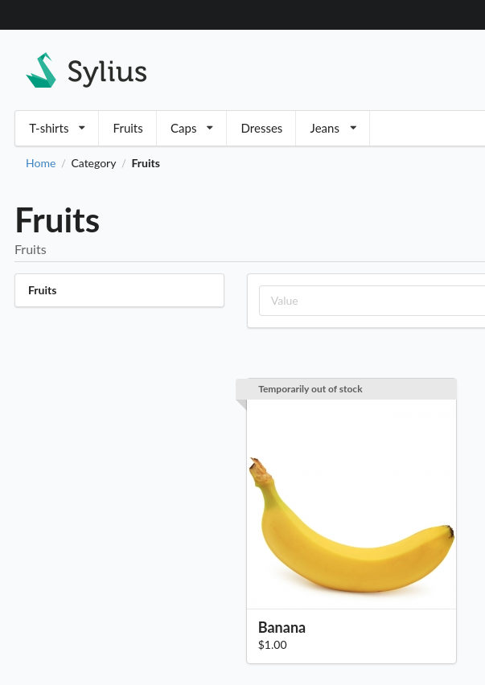
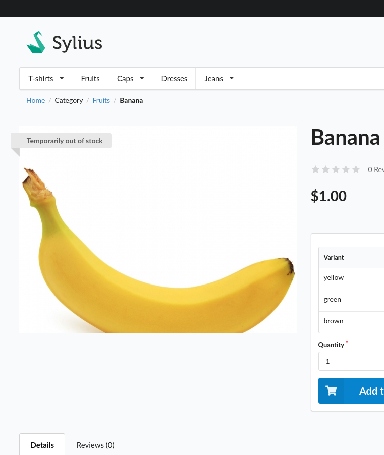

<div class="repo-badge inline-block vertical-align">
    <a id="status-image-popup" title="Latest push build on default branch: created" name="status-images" class="pointer open-popup">
        
    </a>
</div>

This plugin adds a ribbon clarifying that a product is out of stock to the product cards and main image on the product detail page.




##### Supported Sylius versions:
<table>
    <tr><td>1.6</td></tr>
    <tr><td>1.7</td></tr>
</table>


> **_NOTE:_** *This plugin requires PHP 7.4 or up*

#### Installation:

1. Install using composer:
    ```bash
    composer require nedac/sylius-temporarily-out-of-stock-plugin
    ```
2. Add bundle to bundles.php:
    ```php
    <?php

    return [
        // ...
        Nedac\SyliusTemporarilyOutOfStockPlugin\NedacSyliusTemporarilyOutOfStockPlugin::class => ['all' => true],
    ];
    ```
3. Override templates (on Sylius 1.6, skip to step 4 for Sylius 1.7 or to step 5 when using the bootstrap theme):
    ```twig
    {# templates/bundles/SyliusShopBundle/Product/_box.html.twig #}
    
    
    {{ sonata_block_render_event('sylius.shop.product.index.before_box', {'product': product}) }}
    
    <div class="ui fluid card">
        
            <a class="ui ribbon label nedac-out-of-stock-plugin-card-ribbon">{{ 'nedac.ui.temporarily_out_of_stock'|trans }}</a>
        
        <a href="{{ path('sylius_shop_product_show', {'slug': product.slug, '_locale': product.translation.locale}) }}" class="blurring dimmable image">
            <div class="ui dimmer">
                <div class="content">
                    <div class="center">
                        <div class="ui inverted button">{{ 'sylius.ui.view_more'|trans }}</div>
                    </div>
                </div>
            </div>
            
        </a>
        <div class="content">
            <a href="{{ path('sylius_shop_product_show', {'slug': product.slug, '_locale': product.translation.locale}) }}" class="header sylius-product-name">{{ product.name }}</a>
            
                <div class="sylius-product-price">{{ money.calculatePrice(product|sylius_resolve_variant) }}</div>
            
        </div>
    </div>
    
    {{ sonata_block_render_event('sylius.shop.product.index.after_box', {'product': product}) }}
    ```
    ```twig
    {# templates/bundles/SyliusShopBundle/Product/Show/_images.html.twig #}
    
        
        
        
    
        
        
        
    
        
        
    
    
    <div data-product-image="{{ path }}" data-product-link="{{ original_path }}"></div>
    <div class="ui fluid image" data-lightbox="sylius-product-image" id="nedac-out-of-stock-product-image">
        
            <a class="ui large ribbon label" id="nedac-out-of-stock-ribbon">
                {{ 'nedac.ui.temporarily_out_of_stock'|trans }}
            </a>
        
        <a href="{{ original_path }}">
            
        </a>
    </div>
    
        <div class="ui divider"></div>
    
        {{ sonata_block_render_event('sylius.shop.product.show.before_thumbnails', {'product': product}) }}
    
        <div class="ui small images">
            
                
                <div class="ui image">
                    
                        
                    
                    <a href="{{ image.path|imagine_filter('sylius_shop_product_original') }}" data-lightbox="sylius-product-image">
                        
                    </a>
                </div>
            
        </div>
    
    ```

4. If on Sylius 1.7, please override the templates with the following:
    ```twig
    {# templates/bundles/SyliusShopBundle/Product/Box/_content.html.twig #}

    

    

    <div class="ui fluid card" {{ sylius_test_html_attribute('product') }}>
        <div class="blurring dimmable image">
            <div class="ui dimmer">
                <div class="content">
                    <div class="center">
                        <a href="{{ path('sylius_shop_product_show', {'slug': product.slug, '_locale': product.translation.locale}) }}">
                            <div class="ui inverted button">{{ 'sylius.ui.view_more'|trans }}</div>
                        </a>
                    </div>
                </div>
            </div>
            <div class="ui fluid image">
                
                
                    <div class="ui ribbon label nedac-out-of-stock-plugin-card-ribbon">{{ 'nedac.ui.temporarily_out_of_stock'|trans }}</div>
                
            </div>
        </div>
        <div class="content" {{ sylius_test_html_attribute('product-content') }}>
            <a href="{{ path('sylius_shop_product_show', {'slug': product.slug, '_locale': product.translation.locale}) }}" class="header sylius-product-name" {{ sylius_test_html_attribute('product-name', product.name) }}>{{ product.name }}</a>
            
                <div class="sylius-product-price" {{ sylius_test_html_attribute('product-price') }}>{{ money.calculatePrice(product|sylius_resolve_variant) }}</div>
            
        </div>
    </div>
    ```
    ```twig
    {# templates/bundles/SyliusShopBundle/Product/Show/_images.html.twig #}

    
        
        
        
    
        
        
        
    
        
        
    

    <div data-product-image="{{ path }}" data-product-link="{{ original_path }}"></div>
    <div class="ui fluid image" data-lightbox="sylius-product-image" id="nedac-out-of-stock-product-image">
        
            <a class="ui large ribbon label" id="nedac-out-of-stock-ribbon">
                {{ 'nedac.ui.temporarily_out_of_stock'|trans }}
            </a>
        
        <a href="{{ original_path }}">
            
        </a>
    </div>
    
        <div class="ui divider"></div>

        {{ sonata_block_render_event('sylius.shop.product.show.before_thumbnails', {'product': product}) }}

        <div class="ui small images">
            
                
                <div class="ui image">
                    
                        
                    
                    <a href="{{ image.path|imagine_filter('sylius_shop_product_original') }}" data-lightbox="sylius-product-image">
                        
                    </a>
                </div>
            
        </div>
    
    ```

5. (Beta) If you're using the bootstrap theme on Sylius 1.7:
    ```twig
    {# themes/[YOUR_THEME_NAME]/SyliusShopBundle/views/Product/Box/_content.html.twig #}

    

    

    <div class="card border-0" {{ sylius_test_html_attribute('product') }}>
        <a href="{{ path('sylius_shop_product_show', {'slug': product.slug, '_locale': product.translation.locale}) }}">
            
            
            <div class="card-img-overlay" style="padding-left: 0.75rem; padding-top: 0.75rem">
                <h5><span class="badge badge-secondary" {{ sylius_test_html_attribute('product-out-of-stock') }}>{{ 'nedac.ui.temporarily_out_of_stock'|trans }}</span></h5>
            </div>
            
        </a>
        <div class="card-body text-center" {{ sylius_test_html_attribute('product-content') }}>
            <h6 class="sylius-product-name" {{ sylius_test_html_attribute('product-name', product.name) }}>{{ product.name }}</h6>
            
                <span class="text-muted sylius-product-price" {{ sylius_test_html_attribute('product-price') }}>
                    {{ money.calculatePrice(product|sylius_resolve_variant) }} |
                </span>
            
            <a href="{{ path('sylius_shop_product_show', {'slug': product.slug, '_locale': product.translation.locale}) }}" class="card-link">{{ 'sylius.ui.view_more'|trans }}</a>
        </div>
    </div>
    ```
    ```twig
    {# themes/[YOUR_THEME_NAME]/SyliusShopBundle/views/Product/Show/_images.html.twig #}

    
        
        
        
    
        
        
        
    
        
        
    

    

    <div data-product-image="{{ path }}" data-product-link="{{ original_path }}" style="position: relative; display: inline-block">
    <a href="{{ original_path }}" class="glightbox" data-js-product-image>
        
        <h4 style="position: absolute; left: 25px; top: 15px;"><span class="badge badge-secondary" {{ sylius_test_html_attribute('product-out-of-stock') }}>{{ 'nedac.ui.temporarily_out_of_stock'|trans }}</span></h4>
        
        
    </a>
    </div>
    

    {{ sylius_template_event('sylius.shop.product.show.before_thumbnails', {'product': product}) }}

    <div class="row mt-3">
        
        
        <div class="col-4" data-js-product-thumbnail>
        
            
        
            <a href="{{ image.path|imagine_filter('sylius_shop_product_original') }}" class="glightbox">
                
            </a>
        </div>
        
    </div>
    
    ```

6. Modify hack from product repository by overriding it:
    ```php
    <?php

    # src/Repository/ProductRepository.php

    declare(strict_types=1);

    namespace App\Repository;

    use Nedac\SyliusTemporarilyOutOfStockPlugin\Repository\ProductRepositoryTrait;
    use Sylius\Bundle\CoreBundle\Doctrine\ORM\ProductRepository as BaseProductRepository;

    final class ProductRepository extends BaseProductRepository {
       use ProductRepositoryTrait;
    }
    ```
    ```yaml
    # config/packages/_sylius.yaml

    # ...

    sylius_product:
        resources:
            product:
                classes:
                    repository: App\Repository\ProductRepository

    # ...
    ```
    ```yaml
    # config/packages/doctrine.yaml

    doctrine:
    # ...
    orm:
        dql:
            string_functions:
                FIRST: Nedac\SyliusTemporarilyOutOfStockPlugin\Doctrine\Dql\FirstFunction
    # ...
    ```

7. Install assets:
    ```bash
    bin/console sylius:install:assets
    ```

That's it, just four easy steps!

If all went well you've overridden `_images.html.twig`, and either `_box.html.twig` **OR**
`_content.html.twig`, depending on the Sylius version. **Not both.**

#### Setup development environment:
```bash
docker-compose build
docker-compose up -d
docker-compose exec php composer --working-dir=/srv/sylius install
docker-compose run --rm nodejs yarn --cwd=/srv/sylius/tests/Application install
docker-compose run --rm nodejs yarn --cwd=/srv/sylius/tests/Application build
docker-compose exec php bin/console assets:install public
docker-compose exec php bin/console doctrine:schema:create
docker-compose exec php bin/console sylius:fixtures:load -n
```
#### Running tests:
```bash
docker-compose exec php sh
cd ../..
vendor/bin/phpunit
vendor/bin/behat
```
